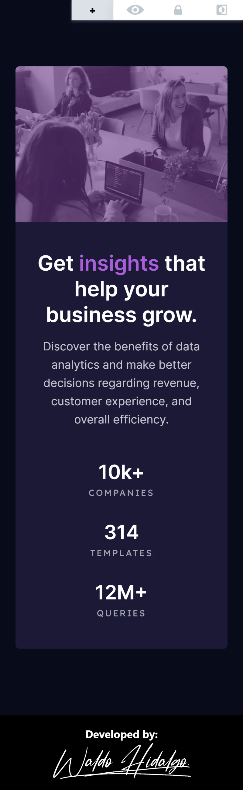

# Stats preview card component

Repositorio con el código solución al challenge: [Stats preview card component challenge on Frontend Mentor](https://www.frontendmentor.io/challenges/stats-preview-card-component-8JqbgoU62)

## The challenge

El desafío consiste en realizar lo siguiente:

> Your challenge is to build out this card component and get it looking as close to the design as >possible.
>
> You can use any tools you like to help you complete the challenge. So if you've got something you'd >like to practice, feel free to give it a go.
>
> Your users should be able to:
>
> - View the optimal layout depending on their device's screen size

## Diseños a Replicar

### 1-Mobile Design

### 2-Desktop Design

## Proyecto Realizado

### 1-Mobile Size

### 2-Desktop Size

